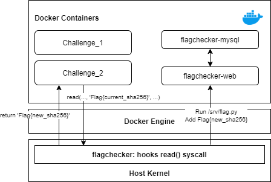

# flagchecker

Effective Cheating Detection for CTFs/competitions. Feel free to submit PR.

This idea was inspired by the way flags were generated in the Korean domestic CTF contest called [Cyber Conflict Exercise](https://www.cstec.kr/cce2020/).

I decided to create this from the scratch.

## How it works

In many recent CTF competitions, docker has been used for effective competition management such as container isolation and log tracing.

All Docker containers use the host kernel, which eventually means that *inserting kernel modules could affect the docker instance*. [Wikipedia](http://en.wikipedia.org/wiki/Docker_(software)) says that

> Docker uses resource isolation features of the Linux kernel such as cgroups and kernel namespaces to allow independent "containers" to run within a single Linux instance, avoiding the overhead of starting virtual machines.

This also means that <u>hooking a syscall from the host kernel will eventually affect the container too</u>.

With this in mind, I developed a simple Linux kernel module called `flagchecker` that generates a random flag and records it somewhere within the host instance to keep the record of user's flag submissions.

What flagchecker does is as follows:

1. Hooks the `read()` syscall.

2. When the binary calls for a `read()` syscall, it looks for the string.

   To ensure that the server does not suffer from the performance bottleneck, <u>the module only reads for the first 255 byte</u>.

3. When there is a value that matches with the hardcoded flag value

   1. The random value is generated. (0-9, a-f)

   2. Replaces the original string with the randomly generated value.

   3. `/srv/flag.py` is then executed to record the randomly generated value.

      

This project was tested on a small CTF named [BingoCTF](https://bingo.hypwnlab.com/) sponsored by [Power of Commmunity (POC)](http://powerofcommunity.net/).

During the test, I created an additional server within the instance to gather the flag and and communicate with the scoreboard server.

Having the flagchecker on the same machine made it easier for the scoreboard server to integrate and for organizers to check cheating attempts.

## How to use

Please refer to the each directory for more information.

## Known Issues

1. **Reading partial data of the flag will leak the original content of the flag.**

   For example,  `head -c68 /flag` will only read the partial data of the flag, leading to the leakage of the original flag.
   Make sure that the original value of flag is randomly generated and does not conflict with other flags.

2. **Kernel will crash when you rmmod after insmod multiple times.**

   It is better off to reboot the server to remove multiple kernel modules.
   
3. **Side Channel Attacks**

   I haven't verified or succeed on exploiting this bug, but it may be possible that `strstr` is vulnerable to timing attacks.
   (Reported by a person who tested this module during the initial development.)

4. **Does not work on latest kernels**

   OS that ships with 5.x may not work.
   There seem to be many [workarounds](https://jm33.me/hook-system-calls-in-linux-5x.html) for this but I was not able to succeed on testing it.
   If anyone's interested to fix it, submitting PR would be really helpful.

## Q&A

> What was the result of the test?

Worth checking [here](https://github.com/stypr/flagchecker/tree/main/docs/examples).

We failed to catch direct flag trades but we managed to catch people who broke the rules.

> I've played some challenges but my flag wasn't changing at that time. What happened to those challenges?

We had a lenient code to cover parts that didn't really require LKM. Check out the following code.

https://github.com/stypr/my-ctf-challenges/blob/master/BingoCTF_2020/temporary/internal/index.php#L6-L21

I've added the code to generate the flag but didn't disclose this part while handing out the dist file.

> You said your idea was inspired from the other CTF i.e. CCE. Are you sure they implemented such codes?

It's just an assumption. I have not directly asked organizers how they implemented such behaviors, but I tried to make something similar because it seemed pretty interesting.
